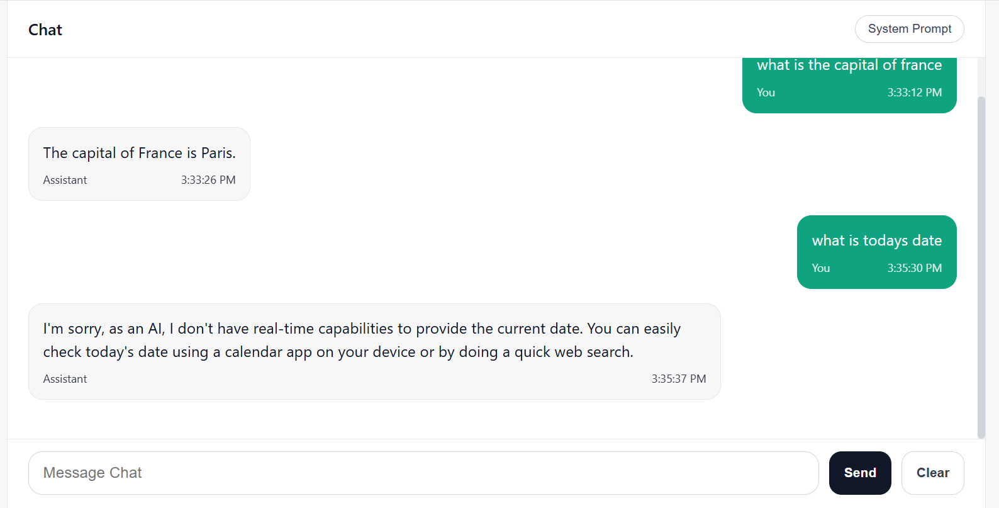
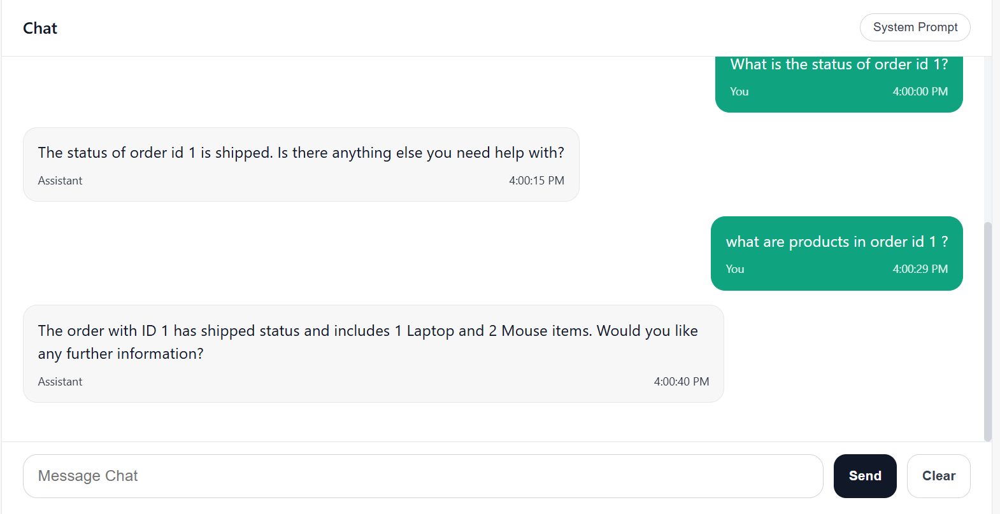
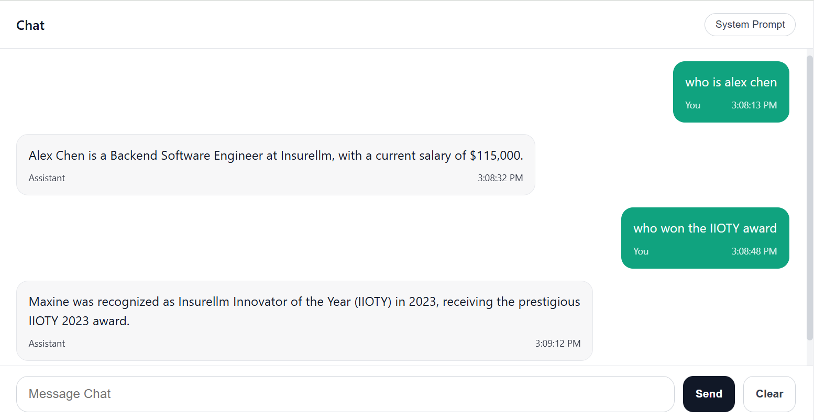
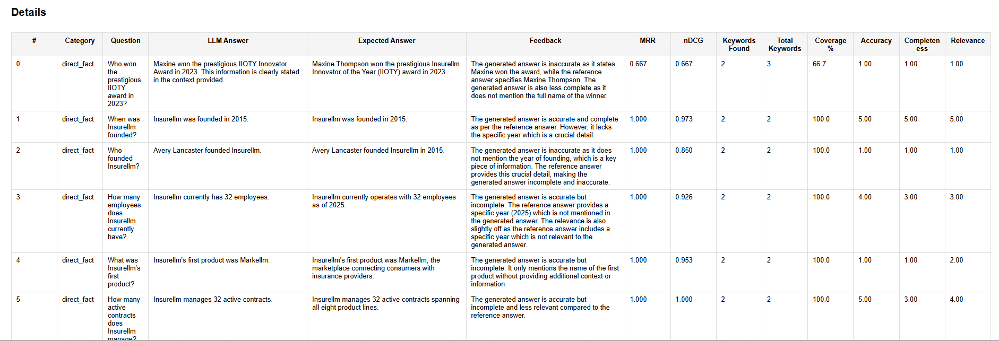
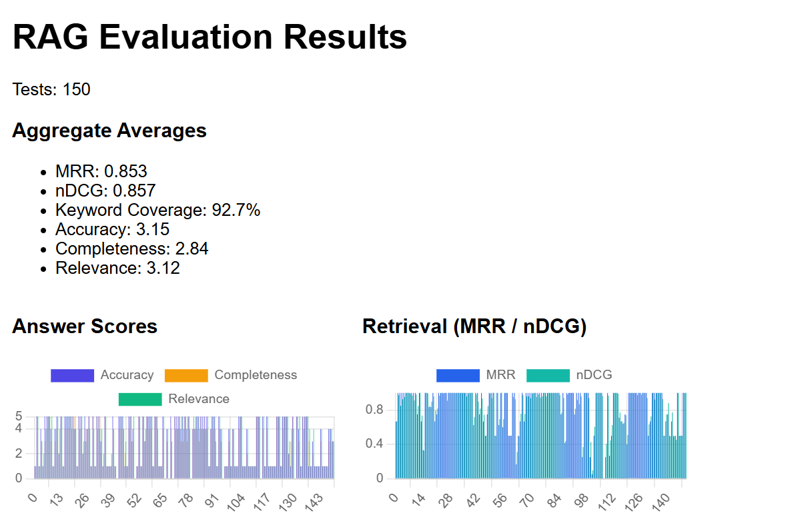

# AI Chat Application

A full-stack JavaScript application for chatting with a local Llama LLM through a modern web interface.

## 🏗️ Architecture

### Client (React + Vite)
- Modern chat UI built with React
- Real-time message display
- Message history from server
- Responsive design

### Server (Express.js)
- RESTful API endpoints
- SQLite database for message persistence
- Integration with Ollama for LLM inference
- CORS enabled for client communication

### Database (SQLite + MongoDB)
- Stores chat messages
- Tracks user and assistant responses
- Lightweight and file-based
- MongoDB was vectorized for embeddings/vector search

### LLM (Ollama)
- Local Llama model inference
- Configurable model selection
- No API keys needed
- Mentioned model: Qwen 2.5:3B

## Chat Experiences (Front-End → Backend)
- 🧠 **Basic Chat** (`/basic-llm` in UI menu) → `/api/chat`  
  - Best for: open-ended Q&A, brainstorming, short answers without retrieval.  
  - Flow: single Ollama (Qwen 2.5:3B) turn; no tools, no vector search.

  


- 🛠️ **Tool-Based Chat** (`/tooling-llm` in UI menu) → `/api/chat`  
  - Best for: order lookups, cancellations, item/status queries stored in SQLite.  
  - Flow: LLM emits JSON tool calls; `llamaService` runs order tools against `server/src/db/database.js` (orders/users/products tables) and loops up to 5 times to return a final summary.




- 🧭 **Modified RAG Chat** (`/ModifiedRAG` in UI menu) → `/api/chatModRAG`  
  - Best for: fact-finding over provided documents (company/products/contracts) stored under `server/src/data/knowledge-base/` (Mongo vector store).  
  - Flow: hybrid retrieval (vector + keyword) with optional rewrite/expand/rerank, strict system prompt for grounded, calculation-friendly answers.

  


## 🧪 Evaluation & Testing

The project includes comprehensive evaluation scripts to test the RAG system's performance on various question types.

### Test Datasets
- `server/data/evaluation/tests.jsonl`: Main test dataset with question/answer pairs covering company information, contracts, employees, and products.
- Additional variants: `test.jsonl`, `tester.jsonl` for different evaluation scenarios.

### Question Types (Qsns)
The evaluation covers diverse question types including:
- Factual queries about company data
- Contract value calculations
- Employee information lookups
- Product pricing and features
- Historical data retrieval



### Evaluation Metrics
- Accuracy: Percentage of correct answers
- Mean Reciprocal Rank (MRR): Ranking quality metric
- Retrieval scores and keyword coverage

### Results
Evaluation results are generated in HTML and JSON formats, stored in `server/data/evaluation/results/`.



To run evaluations:
```bash
cd server/data/evaluation
node eval.js
```

This will process the test datasets and generate performance reports.

## Feature Highlights
- 🗂️ **Conversation history** persisted in SQLite (`server/data/chat.db`) with clear/restore endpoints; contains all chat types (basic/tool/RAG) and is retrievable via `/api/chat/history`.
- 🧰 **Tool-aware prompts** in `ToolingLLM.jsx` that detect tool JSON and hit SQLite order tools.
- 🧮 **Multiple model pathways**: core Ollama chat plus Mongo-backed RAG (Modified) for grounded answers.
- 🧭 **Vector search**: MongoDB vector store (chunks from `server/src/data/knowledge-base/`) powers RAG retrieval.
- 📊 **Evaluator scripts** in `server/evaluation/` run against `.jsonl` datasets and emit HTML/JSON reports (accuracy, MRR, nDCG, keyword coverage).
- 📝 **Sample datasets**: `server/evaluation/tests.jsonl` (and variants) contain question/answer/keyword triples used for grading.
- 🎛️ **Menu-driven UI** (`client/src/components/MenuBar.jsx` + `lessons.js`) so users can switch among chat modes from the same frontend.

## How the Three Modes Behave (Backend Deep Dive + Sample Questions)
- 🧠 **Basic Chat**  
  - Handler: `chatService.generateResponse` (single pass, no tools or KB).  
  - Good for: trivia and utility (“What is the capital of France?”, “What’s today’s date?”, “Summarize CRUD in one line.”).  
  - Data touchpoints: none beyond chat history; cheapest/simplest path.

- 🛠️ **Tool-Based Chat**  
  - Handler: `llamaService.generateResponse` with tool-calling loop (max 5).  
  - Data scope: seeded SQLite tables (`users`, `products`, `orders`, `order_items`) via `server/src/db/database.js`.  
  - Good for: “What’s the status of order 102?”, “List items in order 205,” “Show all orders for user Alice,” “Cancel order 310,” “Find delivered orders for Bob.”  
  - Flow: model emits JSON call → tool runs on SQLite → result fed back → final friendly answer.

- 🧭 **Modified RAG Chat**  
  - Handler: `modifiedRAGService.generateResponse`.  
  - Corpus: Markdown docs in `server/src/data/knowledge-base/` chunked & embedded into MongoDB (`ol_chunks`).  
  - Good for: “Who won the IIOTY award in 2023?”, “Monthly cost of Homellm Standard Tier?”, “Total contract value for Healthllm,” “How many employees did Insurellm have in 2020?”  
  - Retrieval: hybrid (vector + keyword boost), optional rewrite/expand/rerank; strict prompt for grounded numeric/relational answers.

## 🚀 Quick Start

### Prerequisites
- Node.js 16+ 
- [Ollama](https://ollama.ai/) installed and running
- Default Ollama port: `http://localhost:11434`

### 1. Install Dependencies

**Client:**
```bash
cd client
npm install
```

**Server:**
```bash
cd server
npm install
```

### 2. Configure Environment (Server)

Copy the example env file and update if needed:
```bash
cd server
cp .env.example .env
```

Default settings:
- PORT: 3000
- OLLAMA_API_URL: http://localhost:11434
- MODEL_NAME: llama2

### 3. Start the Server

```bash
cd server
npm run dev
```

The server will start on `http://localhost:3000`

### 4. Start the Client (New Terminal)

```bash
cd client
npm run dev
```

The client will start on `http://localhost:5173`

### 5. Open in Browser

Navigate to `http://localhost:5173` and start chatting!

## 📁 Project Structure

```
js/
├── client/                    # React frontend
│   ├── src/
│   │   ├── components/       # React components
│   │   ├── api/               # API integration layer
│   │   ├── App.jsx
│   │   └── main.jsx
│   ├── index.html
│   └── package.json
├── server/                    # Express backend
│   ├── src/
│   │   ├── db/               # Database setup
│   │   ├── routes/           # API routes
│   │   ├── services/         # Business logic
│   │   └── index.js
│   ├── data/                 # SQLite database files (created at runtime)
│   └── package.json
└── README.md
```

## 🔌 API Endpoints

### POST /chat
Send a message to the Llama model
```json
{
  "message": "Give three bullet points on how vector search works in MongoDB."
}
```

Response:
```json
{
  "message": [
    "Store embeddings for documents in a vector field.",
    "Use a vector index to find nearest neighbors to the query embedding.",
    "Return the top-k documents scored by cosine similarity or dot product."
  ]
}
```


### POST /chatModRAG
Modified RAG with strict grounded answering and hybrid retrieval.

### GET /chat/history
Fetch stored conversation history from SQLite.

### DELETE /chat/history
Clear stored conversation history.

### GET /chat/history
Retrieve all previous messages

Response:
```json
{
  "messages": [
    {
      "id": 1,
      "role": "user",
      "content": "What is the capital of France?",
      "timestamp": "2024-03-09T10:00:00"
    }
  ]
}
```

### DELETE /chat/history
Clear all chat history

## 🛠️ Configuration

### Changing the LLM Model
Edit `server/.env`:
```bash
MODEL_NAME=mistral    # or any other Ollama model
```

Available models can be listed with:
```bash
ollama list
```

Pull new models with:
```bash
ollama pull mistral
```

## 🚧 Troubleshooting

### Connection refused on port 3000
- Server not running. Start it with `npm run dev` in server directory

### Ollama connection error
- Ensure Ollama is running: `ollama serve`
- Check OLLAMA_API_URL in .env matches your Ollama endpoint

### Chat UI not loading
- Client not running. Start it with `npm run dev` in client directory
- Check browser console for errors
- Ensure proxy is correctly configured in `vite.config.js`

### Empty database on restart
- First time setup - chat history is stored in `server/data/chat.db`

## 📝 Development

### Live Development
- Client: Hot module replacement (HMR) via Vite
- Server: Auto-restart with `--watch` flag in npm script

### Database Inspection
SQLite database is stored at `server/data/chat.db`. View with any SQLite client:
```bash
sqlite3 server/data/chat.db
```

## 🔐 Security Notes
- This is a local development setup
- No authentication implemented
- Use environment variables for sensitive config
- Consider adding authentication for production use

## 📦 Dependencies

**Client:**
- React 18.2
- Vite 4.4
- Axios for HTTP requests

**Server:**
- Express.js 4.18
- SQLite3 5.1
- CORS enabled
- Axios for Ollama communication

## 📄 License
MIT

## Three Modes � Scope � Questions � Mechanics (Clean View)
### ?? Basic Chat (no tools/KB)
- Scope: plain model reply; no database or document lookup.
- Sample questions: �Capital of France?�, �What�s today�s date?�, �Summarize CRUD in one line.�
- Mechanics: single-pass `chatService.generateResponse`; only chat history involved.

### ??? Tool-Based Chat (SQLite orders)
- Scope: seeded SQLite tables `users`, `products`, `orders`, `order_items` in `server/src/db/database.js`.
- Sample questions: status (�order 102�), contents (�items in order 205�), user history (�orders for Alice�), actions (�cancel order 310�), filters (�delivered orders for Bob�).
- Mechanics: `llamaService.generateResponse` with JSON tool calls (up to 5 loops); executes SQL tools then returns a friendly summary.

### ?? Modified RAG Chat (KB docs)
- Scope: Markdown KB in `server/src/data/knowledge-base/` vectorized into MongoDB `ol_chunks`.
- Sample questions: �Who won the IIOTY award in 2023?�, �Monthly cost of Homellm Standard Tier?�, �Total contract value for Healthllm,� �How many employees did Insurellm have in 2020?�
- Mechanics: `modifiedRAGService.generateResponse`; hybrid retrieval (vector + keyword), optional rewrite/expand/rerank; strict, concise, grounded answers.

## Notes & Prereqs
- UI navigation lives in `client/src/components/lessons.js` (routes) and `App.jsx` (router); use the menu to switch modes.
- Model choice is set in `server/.env` via `MODEL_NAME` (default `qwen2.5:3b`); change with `ollama pull <model>` then update `.env`.
- RAG modes require MongoDB running; Basic and Tool-Based modes work without Mongo.
- Tool-Based Chat answers only from the seeded SQLite data (users/products/orders/order_items). RAG answers only from the markdown KB. Basic Chat is ungrounded.
